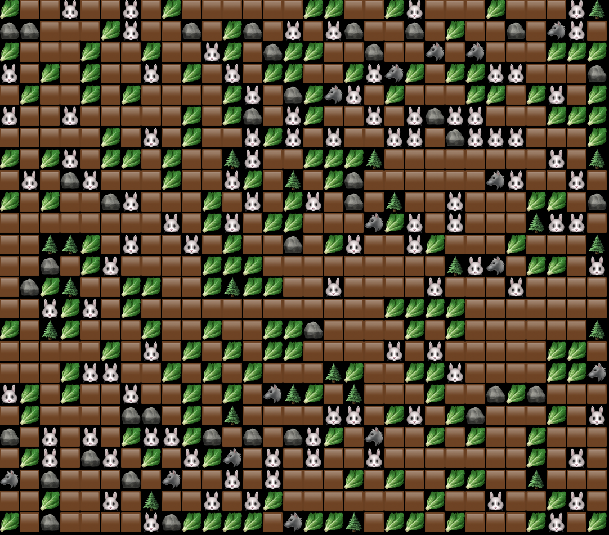
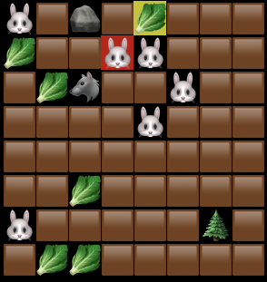
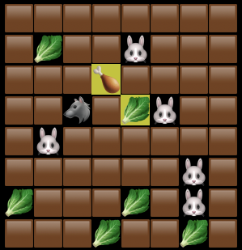
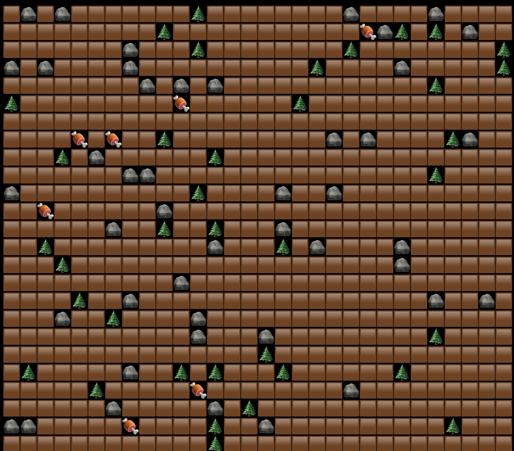

#### [Technical specifications](https://zhukovsd.github.io/java-backend-learning-course/Projects/Simulation/)

User is prompted to set up a worldMap: input sizes and percentage of entities of each type (🐰 🐺 🥬 🌲 🪨).

The example of the 30x25 worldMap, 13% of it is filled with the herbivore, 2% — the predator, 21% - the grass, 5% - the rock, 
3% - the tree:  

At every step of simulation the creature loses 5% of hit points of its maximum.   
If current percentage of the creature's hit points is greater than 65% of its maximum, the creature moves in a random
way on one cell 4-directionally (horizontal and vertical; if there is not an available cell, the creature stays in place). 
When the herbivore is not hungry, it considers the grass as an obstacle; when the predator is not hungry, it considers the 
herbivore/the remains of an herbivore as an obstacle.   
If current percentage of hit points is less than or equal 65% of its maximum, the creature gets started to find the nearest 
target (Breadth First Search algorithm is used): the grass is a target for herbivore; the herbivore/the remains of 
an herbivore is a target for the predator.

When the creature's hit points equal 0, the remains of the creature appears on its place (the herbivore remains — 🍗, 
the predator remains — 🍖).  
The grass and the remains of the creature are considered as food and have got the amount (the amount of grass — 2, 
the amount of the remains of the herbivore — 3, the amount of the remains of the predator — 4). An interaction
with food reduces its current amount on 1 point and restore the creature health on 35% of its maximum hit points. 
When an amount of food equals 0, it disappers from the worldMap. The remains of the predator is not considered as food
for the herbivore, neither for other predator (actually, it is considered as a usual obstacle as trees and rocks).

The creature's hit points is a random number within a certain range (the herbivore — [35; 50], the predator — [30; 35])
The predator's damage is calculated before its every attack within [8; 16].
The herbivore can eat grass, the predator can eat the remains of the herbivore and attack the herbivore 
(the predator does not restore its hit points by damaging the herbivore).
The creature is able to eat and attack 8-directionally.

The herbivore might be highlighted in red. This means that on a previous step it was attacked by the predator.
The grass and the remains of the herbivore might be highlighted in yellow. This means that on a previous step 
they were interacted with the creature (the creature ate that food):  
 

If there is not any alive creature on a worldMap, simulation finishes:

Simulation has got a steps counter, might be paused or finished prematurely.

How to run the application:
- mvn package
- java -jar target/simulation-1.0.jar
